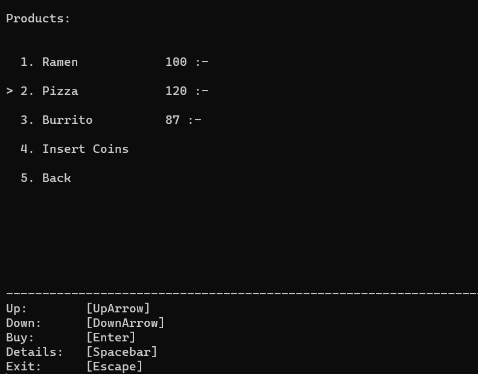

# Inlämningsuppgift 1 

## Konsol Automat - David Nilsson 
#

## Applikationen 

Denna konsolapplikation simulerar en automat som innehåller ett antal produkter. För att “köpa” dessa produkter måste det finnas tillräckligt mycket pengar på “maskinbalansen” i automaten. För att öka denna balans sätter användaren in mynt från sin digitala plånbok in i maskinen. Användaren får sedan välja önskad produkt för att genomföra sitt köp. När ett köp gått igenom läggs produkten i användarens digitala väska, maskinens balans töms och översätts till närmast motsvarande värde i mynt som går tillbaka till plånboken igen. Användaren kan sedan interagera med den köpta produkten i sin digitala väska, varpå en text som beskriver interaktionen visas. När en produkt har använts försvinner den ur väskan då den blivit förbrukad.  

 
## Navigation 

Alla sidor innehåller en “SelectionListComponent” som innehåller saker som användaren kan göra eller interagera med. En pil (“>”) till vänster om rad indikerar vilket objekt i listan som är valt. I botten av varje sida kan användaren se vilka kontroller som finns tillgängliga för tillfället. Dessa kontroller är dynamiska och ändras beroende på vilket menyobjekt som för tillfället är valt. 

## Product

Alla produkter ärver från den abstrakta klassen “Product”. I detta arv ingår namn, pris, en kort beskrivning, användningstext samt vilken kategori den specifika produkten tillhör. Kategorierna är:  

- Liquid 

- Meal  

- Stone  

Dessa kategorier används för att filtrera produkter utefter användarens behov och hålla antalet visade produkter på en rimlig nivå. Klassen “Product” implementerar även metoder från interface “IProduct”. Dessa metoder är: 

- Use: Returnerar en text-sträng som beskriver interaktionen med produkten 

- Description: Returnerar en kort beskrivning på produkten 

- Buy: Returnerar en text-sträng som bekräftar att köpet har gått igenom 

- Clone: Returnerar en kopia av produkten  

Innehållet i “Use”, “Description” och “Buy” satte jag i underklasserna då jag hade en tanke om att jag eventuellt ville ha dem lite olika beroende på produkt. I slutändan var detta inget som utnyttjades och jag hade lika gärna kunnat tilldelat innehållet av metoderna i bas-klassen, men det fick vara kvar som de var.  

 

## Coin 

Som tidigare nämnt så finns det mynt användaren använder för att fylla maskinens balans. Dessa mynt-objekt ärver från abstrakta klassen “Coin”.  Ett mynt har ett namn och ett värde, dessa är hårdkodade i underklasserna. Totalt finns det tre underklasser: 

- OneCrown: värd 1 

- FiveCrown: värd 5 

- TenCrown: värd 10 

 

## Wallet: 

Denna klass används för att lagra användarens mynt. 

 

## Store:  

Denna klass har en lista på de produkter som finns att köpa, det är också här som maskinbalansen lagras, dvs hur mycket användaren har satt in i automaten. Det är alltså Store och Wallet som kommunicerar när ett köp ska genomföras. 

 
## UserSession 

För att hålla reda på visa globala värden som alla sidor skulle ha tillgång till, gjorde jag en statisk klass som heter “UserSession”. Det är denna klass som instansierar en “Store”,  en “Wallet” samt en lista med de produkter som användaren har i sin väska. Dessa objekt instansieras vid appens uppstart. På så sätt kan alla sidor få tillgång till dessa objekt och ta del av deras metoder och properties.  
 

## PageComponent 

Denna klass är till för att vara innehåll på en sida, det kan till exempel vara en lista som användaren kan interagera med eller bara en text som användaren ska kunna se. Det fanns en tanke om att kunna bygga flera underklasser av pageComponent vid behov, bland annat hade man kunnat göra en textinput ifall man skulle vilja att användaren skulle kunna skriva in något värde. Dock var detta inget som behövdes i slutändan. Interfacet IControlable implemnteras ifall man vill att sidan ska uppfatta komponenten som just kontrollerbar, dvs att användaren ska kunna interagera med komponenten. 

 

## SelectionListComponent 

Denna klass som tidigare nämnt är till för att användaren ska kunna välja mellan olika alternativ, det kan antigen vara olika produkter att interagera med eller olika sidor användaren kan ta sig till. Dessa “val” som finns i listan är “ListOption”-objekt som innehåller namn och ett generiskt “object”. Anledningen till att den har ett “object” är för att det ska kunna vara vilken klass som helst (som inte är statiskt dvs) och på så sätt få tillgång till vad det för något som användaren vill interagera med. 

 

## Page 

Page är en abstrakt klass som alla sidor ärver ifrån, en page innehåller en lista med flera “PageComponent’s”. Utifall att det skulle finnas flera komponenter som är interaktiva så måste en komponent sättas som “Focused”, vilket innebär att man endast interagerar med just den komponenten. Det finns lite interfaces som Page kan implementera, ISelecter, IRedirecter och IExitable. Dessa är bara för att sätta lite krav på sidor som man vill ska ha möjlighet för just dessa saker. Till exempel om man vill att man ska kunna stänga ner applikationen direkt från en sida skall denna sida implementera IExitable.  

 

## Controller: 

Alla sidor innehåller en “Controller”. Detta är en klass som håller reda på vilka kontroller som sidan har. En “Controller” innehåller i sin tur ett “Dictionary” som heter “Mapped”, denna lagrar “ControlAction” som värden och tangetknappar som nycklar. Detta gör så att man enkelt kan nå vilken “ControlAction” som ska triggas med hjälp av vad användaren har tryckt på för tangent. ControlAction innehåller i sin tur ett namn och en action/funktion som man vill ska triggas när användaren tryckt på motsvarande knapp. 

## InputHandler  

InputHandler är en statisk klass som hjälper till att ta emot en “Controller” och inväntar användarens input för att sedan skicka den knapptryckningen till controllern så den kan sköta resten själv. Anledningen för detta mellansteg är för att InputHandler är tillgängligt överallt is systemet och på sådant sätt blir det enklare att hålla koll på dataflödet. 

## PageBuilder 

Denna statiska klass har bland annat en metod som heter “BuildPage” som tar emot ett “Page”-objekt som den sedan sätter ihop och gör till en enda sträng som den sen sedan skriver ut i konsolen. Man kan se det som att det är denna metod som “uppdaterar” vad användaren ser på skärmen. 

## PageHandler 

Detta är också en statisk klass vars uppgift är att sköta flödet av applikationen. Så länge “bool”-variabeln “isExiting” är falsk så kommer programmet fortsätta rulla. För varje loop är det fyra viktiga steg som sker. 

Sidan uppdateras: alla värden och kontroller uppdateras på sidan 

Sidan byggs: Pagebuilder sätter ihop och skriver ut vad som ska vara på displayen 

Input hanteras: InputHandler tar emot och triggar funktioner som uppdaterar olika värden i systemet 

Nästa sida sätts: Om sidan har tilldelats en ny sida i föregående steg så returneras denna sida till “nextPage” och som is sådantfall sedan blir “currPage” (nuvarande sida). Om det skulle vara så att nuvarande sida är en “ExitPage” så uppdateras variabeln “isExiting”, dvs om applikationen ska stängas ner eller om loopen ska fortsätta. 

## ConsoleHelper 

Denna statiska klass är till för att hjälpa olika funktioner med återkommande saker som kan behövas. Bland annat har den en metod som heter “Multiply” som tar emot en textsträng samt en siffra, det den sedan returnerar är textsträngen multiplicerat på siffran. Till exempel matar man in “hej” och 5 så returneras “hejhejhej”. Detta kan användas när jag vill sätta radavstånd etc. 

 

## Tankar: 

Målet var att försöka göra en generisk och dynamisk grund som kan återanvändas i andra konsolappar, detta är iallafall ett steg på vägen. Framförallt när de kommer till hur kontrollerna funkar. Dock finns det många problem med appen som gör det lite omständigt att jobba med. Bland annat är det fortfarande alldeles för många steg som måste göras för att skapa en ny sida. Detta gör också svårt att hålla enhetlighet i sin applikation. Jag har separat sparat grunden som ett template och kan fortsätta förbättra den om jag skulle få vägarna förbi. 
